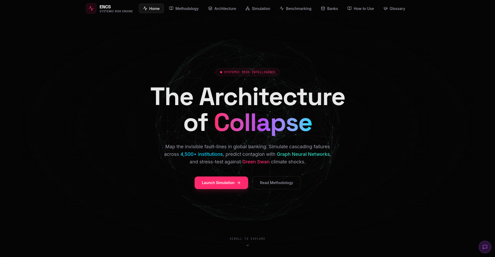
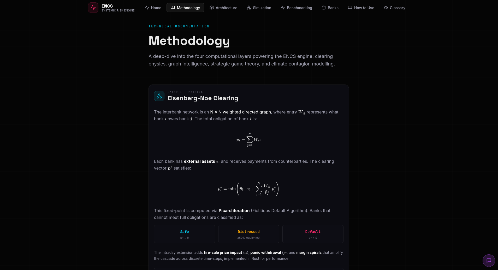
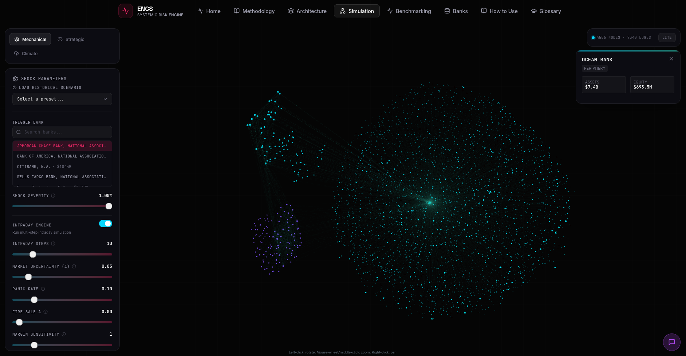
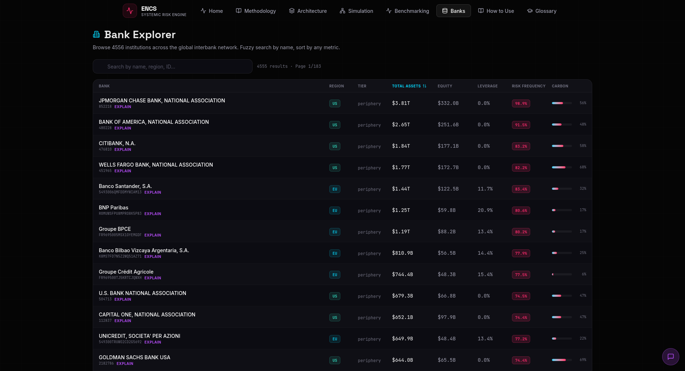

# ENCS Banking Simulator: Systematic Risk & Contagion Engine

> Created for **Datathon 2026** at **K. J. Somaiya College of Engineering** by Team **Low Taper Fade**.

**An advanced financial stability platform combining Graph Neural Networks, Strategic Agent Modeling, and High-Performance Simulations.**

This project is a comprehensive toolkit for analyzing systemic risk in banking networks. It goes beyond static stress testing by modeling the dynamic, endogenous nature of financial contagion—where one bank's distress triggers fire sales, liquidity runs, and defaults across the entire system.



## Key Features & Deep Dive

### 1. High-Fidelity Contagion Simulation (Rust + Python)
At the heart of the engine lies a **Monte Carlo-based Intraday Liquidity Model**. Unlike traditional static models, we simulate the banking system in discrete time steps to capture the rapid unfolding of a crisis.

*   **Monte Carlo Uncertainty:** We model "solvency signals" with Gaussian noise. Creditors don't know a bank's true health perfectly; they receive noisy signals. If the signal drops below a `panic_threshold`, they withdraw funding.
*   **Exponential Fire Sales:** When banks face liquidity withdrawals, they must sell assets. We model price impact using an exponential decay function: $P_{t+1} = P_t \cdot e^{-\alpha \cdot \text{Volume}}$, creating a feedback loop where selling drives down prices, forcing more selling.
*   **Eisenberg-Noe Clearing:** At every time step, we solve the fixed-point clearing vector to determine exactly how much each bank can pay its obligations given its current liquidity.
*   **Rust Acceleration:** The core simulation loop is implemented in **Rust** using `ndarray` for matrix operations, offering 10-50x speedups over pure Python. This allows us to run thousands of Monte Carlo trajectories in seconds.



### 2. Strategic "Game Theory" Agents
*   **Bayesian Decision Making:** Implements the **Morris & Shin** global game framework. Banks (agents) receive private and public signals about their counterparties' solvency.
*   **Endogenous Runs:** Liquidity runs aren't just random events—they emerge from rational banks deciding to withdraw funding based on their risk aversion and beliefs about others' actions.
*   **Regime Analysis:** Compare "Opaque" vs. "Transparent" information regimes to see how disclosure impacts stability.

### 3. AI-Driven Risk Prediction (GNN)
*   **Graph Neural Networks:** Uses a **Principal Neighbourhood Aggregation (PNA)** network to analyze the topology of the banking web.
*   **Early Warning System:** Predicts "Risky" vs. "Safe" status for banks based purely on their network position and balance sheet, even before a crash occurs.
*   **Explainable AI:** Integrated with GNNExplainer to identify exactly *why* a specific bank is flagged as high-risk (e.g., "High leverage combined with exposure to Bank X").

### 4. Climate & Transition Risk ("Green Swans")
*   **Carbon Tax Shocks:** Simulates the impact of sudden policy shifts on banks' "Brown" (carbon-intensive) assets.
*   **Green Bubbles:** Models the effects of subsidies and crowding into "Green" assets.

---

## Dataset & Visualization Details

We utilize a curated dataset of approximately **4,500 banks** from the **USA** and **European Union**, constructed to reflect real-world interbank connectivity distributions.

*   **Visual Coding:** In our simulation visualizations:
    *   🔵 **Blue Nodes:** US Banks
    *   🟣 **Purple Nodes:** EU Banks
    *   🔴 **Red Nodes:** Defaulted Banks
    *   🟠 **Orange Nodes:** Distressed Banks

*   **Simulation Scale:** While our backend dataset contains ~4,500 nodes, the interactive 3D simulation renders a sub-graph of the **top ~500 most systemic nodes** to ensure smooth performance in the browser while capturing the most critical contagion channels.

### Interactive Simulation
Watch contagion spread in real-time. The visualizer shows shock propagation, capital depletion, and the resulting defaults.


*Static view of a contagion cascade:*


### Bank Explorer
A detailed view of individual bank balance sheets, leverage ratios, and computed GNN risk scores.



---

## Tech Stack

### Backend
*   **Core Logic:** Python 3.9+ (FastAPI, NumPy, Pandas)
*   **High-Performance Compute:** **Rust** (via PyO3 & Maturin) for the Monte Carlo/Intraday engine.
*   **Machine Learning:** PyTorch, PyTorch Geometric (GNNs).
*   **LLM Integration:** Modules for generating natural language explanations of simulation results.

### Frontend
*   **Framework:** React 19 (Vite)
*   **Visualization:** Three.js, React Three Fiber (`react-force-graph-3d`), Recharts, Plotly.js.
*   **Styling:** Tailwind CSS, Framer Motion.

---

## Project Structure

```text
/
├── backend/
│   ├── api.py                 # FastAPI entry point
│   ├── ml_pipeline.py         # GNN training and inference logic
│   ├── simulation_engine.py   # Core contagion physics (Python fallback)
│   ├── strategic_model.py     # Bayesian game agents
│   ├── encs_rust/             # Rust source code for high-perf simulation
│   │   ├── src/lib.rs         # Monte Carlo & Intraday logic in Rust
│   │   └── Cargo.toml         # Rust dependencies
│   └── data/                  # Network datasets and models
├── frontend/
│   ├── src/
│   │   ├── components/        # React components (NetworkGraph3D, etc.)
│   │   ├── pages/             # Main application views
│   │   └── services/          # API integration
└── .github/                   # CI/CD and Agent definitions
```

---

## Quick Start

### Prerequisites
*   **Python:** 3.9 or higher
*   **Node.js:** 18+
*   **Rust:** (Optional) Required only if you want to rebuild the accelerated simulation engine.

### 1. Backend Setup

The backend handles the simulation logic and API.

```bash
cd backend

# Create a virtual environment
python -m venv venv
source venv/bin/activate  # On Windows: venv\Scripts\activate

# Install dependencies
pip install -r requirements.txt

# (Optional) Build the Rust extension for maximum performance
# Requires Rust toolchain (cargo)
# pip install maturin
# cd encs_rust && maturin develop --release && cd ..

# Start the API server
uvicorn api:app --reload --port 8000
```

### 2. Frontend Setup

The frontend provides the interactive dashboard.

```bash
cd frontend

# Install dependencies
npm install

# Start the development server
npm run dev
```

Open your browser to `http://localhost:5173` (or the port shown in your terminal).

## Contributing

We welcome contributions! Please see the issue tracker for outstanding tasks.

1.  Fork the repo.
2.  Create your feature branch (`git checkout -b feature/AmazingFeature`).
3.  Commit your changes.
4.  Push to the branch.
5.  Open a Pull Request.

## License

Distributed under the GNU General Public License v3.0. See `LICENSE` for more information.
